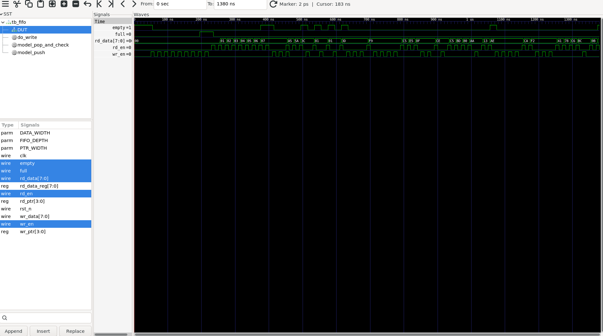

# Synchronous FIFO with Full/Empty Flags (Verilog)

A parameterized synchronous FIFO written in Verilog, verified with a
self-checking testbench — directed tests plus a randomized test checked
against a software reference model — in Icarus Verilog.

## What this project does

- `sync_fifo.v` — an 8-deep, 8-bit-wide synchronous FIFO. Uses one extra
  address bit on the read/write pointers to distinguish FULL from EMPTY
  without needing a separate occupancy counter.
- `tb_fifo.v` — a self-checking testbench with two parts:
  - **Directed tests**: FIFO starts empty, fills to full, correctly
    ignores a write while full (overflow protection), drains completely
    while checking every value comes out in the correct order, correctly
    ignores a read while empty (underflow protection), and handles a
    simultaneous write+read in the same clock cycle.
  - **Randomized test**: 50 random write/read decisions, checked against
    a software reference queue built inside the testbench itself.

## How to run it

Requires [Icarus Verilog](http://bleyer.org/icarus/) and
[GTKWave](http://gtkwave.sourceforge.net/) (both free, open-source):

```bash
iverilog -o sim.out sync_fifo.v tb_fifo.v
vvp sim.out
```

## Result

VCD info: dumpfile fifo_tb.vcd opened for output.
PASS: FIFO is empty after reset

-- A2: Filling FIFO to full --
PASS: FIFO correctly reports FULL after 8 writes
PASS: write while FULL was correctly ignored

-- A4: Draining FIFO to empty --
PASS: expected 0x0  got 0x0
PASS: expected 0x1  got 0x1
PASS: expected 0x2  got 0x2
PASS: expected 0x3  got 0x3
PASS: expected 0x4  got 0x4
PASS: expected 0x5  got 0x5
PASS: expected 0x6  got 0x6
PASS: expected 0x7  got 0x7
PASS: FIFO correctly reports EMPTY after full drain
PASS: read while EMPTY was correctly ignored

-- A6: Simultaneous write + read --
PASS: expected 0xa5  got 0xa5
PASS: expected 0x5a  got 0x5a
PASS: expected 0x3c  got 0x3c

-- B: Randomized write/read sequence (50 operations) --
PASS: expected 0x81  got 0x81
PASS: expected 0x1  got 0x1
PASS: expected 0x3d  got 0x3d
PASS: expected 0xf9  got 0xf9
PASS: expected 0xc5  got 0xc5
PASS: expected 0xe5  got 0xe5
PASS: expected 0x8f  got 0x8f
PASS: expected 0xce  got 0xce
PASS: expected 0xc5  got 0xc5
PASS: expected 0xbd  got 0xbd
PASS: expected 0x80  got 0x80
PASS: expected 0xaa  got 0xaa
PASS: expected 0x13  got 0x13
PASS: expected 0xae  got 0xae
PASS: expected 0xca  got 0xca
PASS: expected 0xf2  got 0xf2
PASS: expected 0x41  got 0x41
PASS: expected 0x78  got 0x78
PASS: expected 0xc6  got 0xc6
PASS: expected 0xbc  got 0xbc
PASS: expected 0xb  got 0xb
PASS: expected 0x7e  got 0x7e

*** ALL TESTS PASSED ***
tb_fifo.v:206: $finish called at 1380000 (1ps)


## Waveform

View the simulation waveform with:
```bash
gtkwave fifo_tb.vcd
```



Reading the trace above:
- **`full`** asserts right after the 8th write completes (the FIFO's
  configured depth), confirming the full-detection logic triggers at
  exactly the right point — not one write early or late.
- **`empty`** starts high after reset, drops on the first write, and
  returns high again immediately after the drain loop reads out the
  last value — confirming empty-detection is equally precise.
- The later, more irregular toggling on `wr_en`/`rd_en` with `rd_data`
  cycling through varied hex values is the randomized test (Part B) in
  progress.

## Design notes

- Read/write pointers are made **one bit wider** than needed to address
  memory. Comparing that extra bit is what distinguishes FULL from EMPTY
  using simple pointer equality, without a separate up/down counter.
- `FIFO_DEPTH` must be a power of 2.
- Overflow (write while full) and underflow (read while empty) are both
  safely ignored rather than corrupting FIFO state.